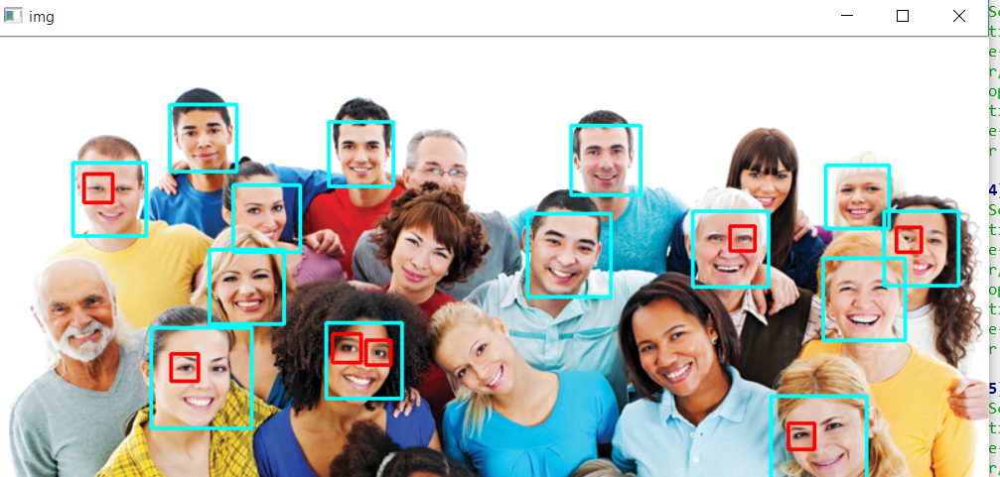

Face-Detection
--------------
Face detection with OpenCV and python.
Using OpenCV's Haar cascades which is a machine learning based approach where a cascade function is trained with a set of input data. OpenCV already contains many pre-trained classifiers for face, eyes, smiles, etc.. 
We will be using the face classifier.
You can visit https://github.com/manishsingh7163/opencv/tree/master/data/haarcascades for more funciton.

1. Used Face Detection in Real Time

.gif)

2. Used Face Detection in Images

Requirements
---------------
1. OpenCV
    https://pypi.org/project/opencv-python/
2. Python 3+

Refernces
---------
https://docs.opencv.org/2.4/modules/objdetect/doc/cascade_classification.html?highlight=cascadeclassifier#cascadeclassifier

https://www.tutorialspoint.com/opencv/opencv_overview.htm
